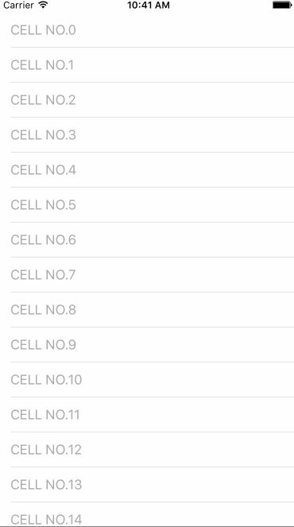

# UIScrollView-ScrollToTopBtn

a UIScrollView category for making a scroll to top button via runtime

Installation

- use cocoapods
```swift
pod 'UIScrollView+ScrollToTopBtn', '~> 0.0.1'
```
- manual import
```swift
just download lib folder and add into your project
```

Usage

- customization for scrollToTop button, you can custom its image、title、backgroundImage or other properties as usually
```swift
    UIButton *btn = [UIButton buttonWithType:UIButtonTypeCustom];
   [btn setImage:[UIImage imageNamed:@"top"] forState:UIControlStateNormal];
//    [btn setTitle:@"go" forState:UIControlStateNormal];
//    [btn setTitleColor:[UIColor lightGrayColor] forState:UIControlStateNormal];
```
- custom some properties
```swift
// frame for scrollToTop button, include the origin position and size. default size: 44.f(side length) and its margin 12.f
	self.tableView.scrollToTopBtnFrame = CGRectMake(self.view.bounds.size.width - 100, self.view.bounds.size.height - 100, 100, 100);

// offset for show/hidden the scrollToTop button, default value:[UIScreen mainScreen].bounds.size.height
	self.tableView.scrollToTopBtnShowOffset = 700.f;
```

- set for your UIScrollView / UITableView / UICollectionView / UIWebView or other views which is subClass of UIScrollView
```swift
 	self.tableView.scrollToTopBtn = btn;
```

# Screenshot



# Release notes

- 0.0.1

`first commit`